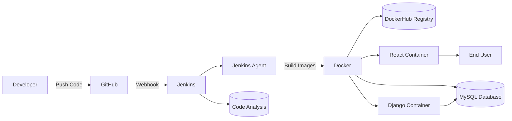
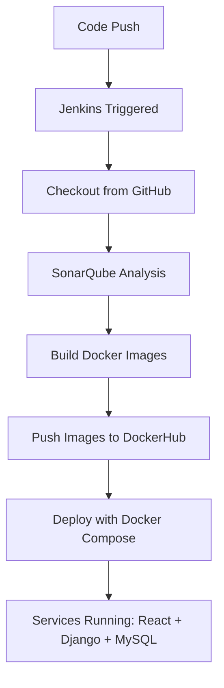

# CI/CD Pipeline for Full-Stack Application (React + Django + MySQL)

## 📋 Introduction

This project presents the design and implementation of a continuous integration and continuous deployment (CI/CD) pipeline for a full-stack application. The application consists of:

- **Frontend**: React.js
- **Backend**: Django (Python)
- **Database**: MySQL

The pipeline is managed with Jenkins, containerized with Docker, and analyzed for quality using SonarQube. The objective is to automate the entire lifecycle of the application (build, test, analyze, deploy) in a virtualized environment.

## 🛠️ Tools and Technologies

| Component           | Technology           |
|---------------------|----------------------|
| Frontend            | React.js             |
| Backend             | Django (Python)      |
| Database            | MySQL                |
| CI/CD Orchestrator  | Jenkins              |
| Code Quality        | SonarQube            |
| Containerization    | Docker               |
| Orchestration       | Docker Compose       |
| Source Control      | GitHub               |
| Image Registry      | DockerHub            |

## 📁 Project Structure


```
project-root/
├── frontend/                  # React application
│   └── Dockerfile.frontend
├── backend/                   # Django application
│   └── Dockerfile.backend
├── docker-compose.yml         # Application stack
├── docker-compose.jenkins.yml # Jenkins, SonarQube, Jenkins agent
├── Jenkinsfile                # CI/CD pipeline
└── README.md                  # Documentation
```

## 🏗️ System Architecture

The infrastructure is based on a VMware-hosted Ubuntu environment with multiple Docker containers. Jenkins acts as the orchestrator of the CI/CD pipeline, coordinating code retrieval, quality analysis, image building, and deployment.




## ⚙️ Setup and Installation

### Prerequisites

- VMware virtual machine running Ubuntu
- Docker and Docker Compose
- GitHub and DockerHub accounts

### Repository Setup

```bash
git clone https://github.com/your-username/your-repo.git
cd your-repo
```

## 🐳 Docker Environment

- **Frontend (React)** → Node.js 18, runs on port 3000
- **Backend (Django)** → Python 3.10, runs on port 8000
- **Database (MySQL)** → Official MySQL image, with persistent volume

Run the application stack:

```bash
docker-compose up -d
```

Access points:

- Frontend: http://localhost:3000
- Backend: http://localhost:8000
- Database: localhost:3306

## 🚀 Jenkins Configuration

1. Unlock Jenkins (`docker-compose logs jenkins`)
2. Install required plugins: Pipeline, Git, GitHub, Docker, SonarQube Scanner, SSH Agent
3. Add credentials (GitHub token, DockerHub credentials, SonarQube token)
4. Configure Jenkins agent (`agent1`) to execute pipeline stages

## 📊 SonarQube Integration

- Access at: http://localhost:9000
- Initial login: admin / admin
- Generate a project token and add it to Jenkins credentials
- Jenkins pipeline triggers static code analysis with results visible in SonarQube dashboards

## 🔗 GitHub Webhook

Configure GitHub → Settings → Webhooks → Add webhook.

- **Payload URL**: `http://<VM-IP>:8080/github-webhook/`
- **Content type**: application/json
- **Event**: push events
- **Jenkins job**: enable GitHub hook trigger for GITScm polling

## 🔄 CI/CD Pipeline Workflow

The Jenkinsfile defines the following stages:

1. **Code Checkout** – Retrieve latest code from GitHub
2. **Static Analysis** – Run SonarQube analysis
3. **Docker Build** – Build Docker images for frontend and backend
4. **Image Push** – Push built images to DockerHub
5. **Deployment** – Restart services using Docker Compose



## ✅ Results

- Automated deployment successfully implemented
- Application accessible at:
  - Frontend: http://localhost:3000
  - Backend: http://localhost:8000
  - MySQL: port 3306
- SonarQube reports confirm code quality compliance
- Jenkins logs demonstrate pipeline reproducibility

## 🎯 Conclusion

This project delivers a fully functional CI/CD pipeline that:

- Automates the full application lifecycle (build → test → analysis → deploy)
- Ensures consistent and reproducible deployments
- Enhances code quality through static analysis
- Provides a scalable base for cloud or production extension

### 🔮 Future Improvements

- Deployment to cloud platforms (AWS, Azure, GCP)
- Integration of automated testing frameworks (unit and end-to-end)
- Security enhancements (secrets management, HTTPS reverse proxy)
